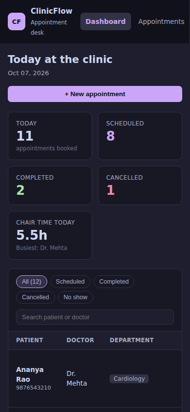
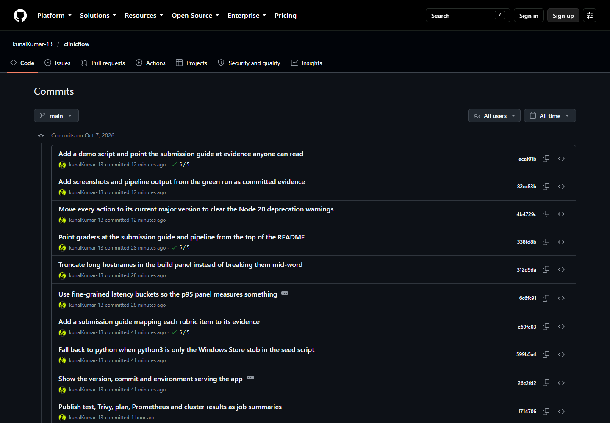
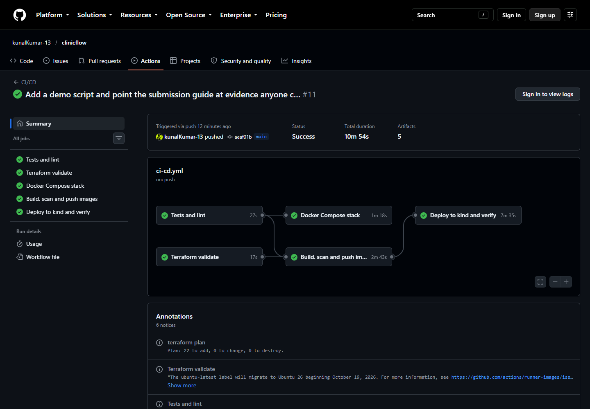
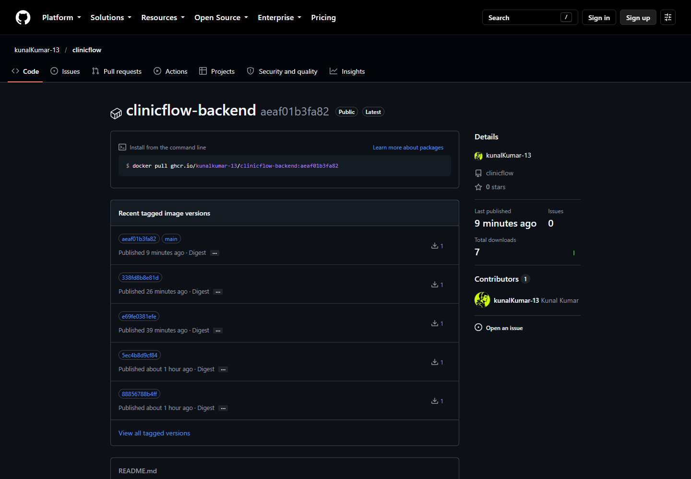
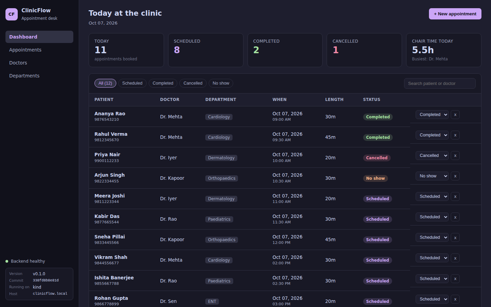
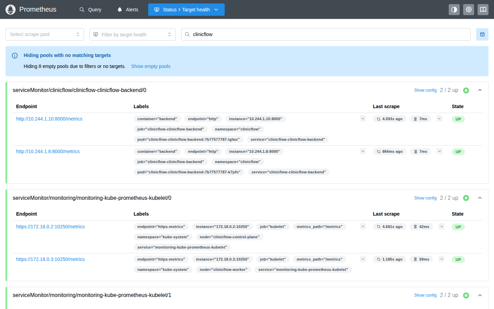
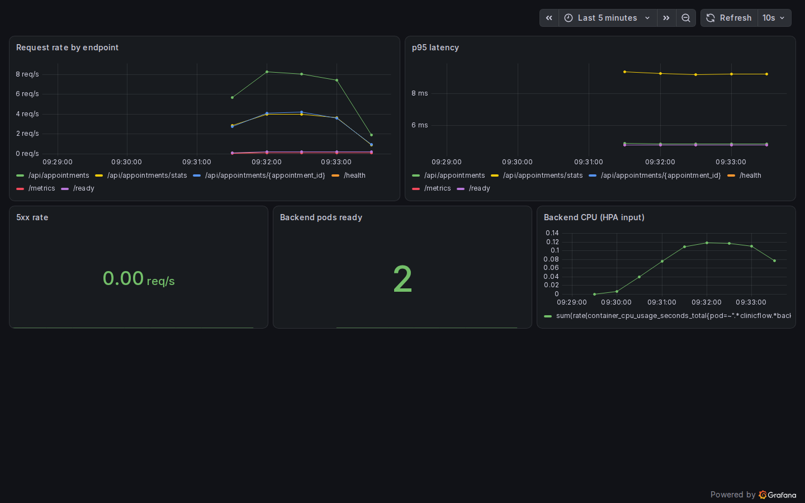

# Capstone submission evidence

Where each item in the grading rubric is satisfied, and where to see it.
Screenshots in [`docs/screenshots/`](screenshots/) were captured automatically
by the pipeline (headless Chromium against the running system) or of public
GitHub pages. Text output from the same pipeline run (test results, Terraform
plan, cluster state) is committed in [`docs/evidence/`](evidence/). None of it
is mocked up.

The pipeline also writes these results to each run's summary page. GitHub only
shows job summaries and logs to signed-in users, which is why the same output is
committed here as well.

**Repository:** https://github.com/kunalKumar-13/clinicflow
**Green pipeline run:** https://github.com/kunalKumar-13/clinicflow/actions/runs/37602165587
**Container images:** [clinicflow-backend](https://github.com/kunalKumar-13/clinicflow/pkgs/container/clinicflow-backend) · [clinicflow-frontend](https://github.com/kunalKumar-13/clinicflow/pkgs/container/clinicflow-frontend)

---

## M1 — Application (10)

| Criterion | Evidence |
|---|---|
| FastAPI responds to `/health` | [`backend/app/main.py`](../backend/app/main.py); checked inside the pod by the deploy job |
| 4+ REST endpoints (GET, POST, PUT, DELETE) | list, get, create, update, delete, stats and meta under `/api`, plus `/health`, `/ready` and `/metrics` |
| PostgreSQL table managed by Alembic | [`backend/alembic/versions/0001_create_appointments.py`](../backend/alembic/versions/0001_create_appointments.py); the pipeline runs `alembic upgrade head` on every push |
| Frontend renders and calls the API | [`frontend/src/main.jsx`](../frontend/src/main.jsx) |
| Responsive, usable UI | desktop:  phone width (390px):  |

## M2 — Testing (10)

| Criterion | Evidence |
|---|---|
| `pytest` runs without errors | [`evidence/pytest-output.txt`](evidence/pytest-output.txt): 14 passed, from the pipeline; locally `cd backend && pytest -v` |
| 5+ tests over 3+ endpoints | 14 tests over 10 routes in [`backend/tests/test_api.py`](../backend/tests/test_api.py) |
| Test database, not production | [`backend/tests/conftest.py`](../backend/tests/conftest.py): a throwaway SQLite file, schema rebuilt around every test |
| `pytest.ini` / `conftest.py` | [`backend/pytest.ini`](../backend/pytest.ini), [`backend/tests/conftest.py`](../backend/tests/conftest.py) |

## M3 — Git and GitHub (5)

| Criterion | Evidence |
|---|---|
| Public repository | https://github.com/kunalKumar-13/clinicflow |
| Meaningful commit messages, 10+ commits |  |
| `.gitignore` excludes `.env`, `__pycache__`, `node_modules`, `.venv` | [`.gitignore`](../.gitignore) |

## M4 — Docker (10)

| Criterion | Evidence |
|---|---|
| `backend/Dockerfile` builds | built on every push by the "Build, scan and push" job |
| Frontend multi-stage (Node build, Nginx runtime) | [`frontend/Dockerfile`](../frontend/Dockerfile) |
| Images run as non-root | backend uid 10001, frontend uid 101; the Compose job prints `id` from both containers |
| `docker compose up --build` starts all three | [`evidence/compose-ps.txt`](evidence/compose-ps.txt): postgres, backend and frontend up, from the pipeline's Compose job; the desktop screenshot above is `localhost:3000` from that stack (its sidebar says `docker-compose`) |

## M5 — CI/CD (15)

| Criterion | Evidence |
|---|---|
| Workflow in `.github/workflows/` | [`ci-cd.yml`](../.github/workflows/ci-cd.yml); a green run:  |
| Triggers on push to `main` | `on: push: branches: [main]` |
| `pytest` runs and fails the build on failure | "Tests and lint" job; `set -o pipefail` so a failing test cannot be masked |
| Frontend built in the pipeline | "Build the frontend" step |
| Docker images for both | "Build backend image", "Build frontend image" |
| Pushed to GHCR |  |
| Tags use the commit SHA | every image is tagged with the first 12 characters of the commit SHA; `main` is a moving tag alongside, never `latest` |

## M6 — DevSecOps (5)

| Criterion | Evidence |
|---|---|
| Trivy scans both images in CI | "Trivy report" and "Trivy gate" steps for backend and frontend |
| Fails on HIGH or CRITICAL | gate uses `severity: HIGH,CRITICAL`, `exit-code: 1`; images are pushed only after it passes |
| Explaining a finding | below |

**What Trivy scanned and what it found.** Trivy scans each built image for known
vulnerabilities in two layers: the operating-system packages of the base image
(Debian for the backend, Alpine for the frontend) and the application's own
dependencies (the Python packages in the backend).

The gate failed the very first time it ran, on the backend, with six HIGH
findings in the Python dependencies. One example is **CVE-2025-62727 in
Starlette 0.41.3**: a denial of service in how Starlette's `FileResponse` merges
the byte ranges of an HTTP `Range` header, where a crafted header with many
overlapping ranges makes the server do quadratic work on a single request.
Starlette is the web framework under FastAPI. In this particular API the
practical exposure was low, because it never serves files, but the gate
deliberately blocks fixable HIGH findings without trying to judge reachability
case by case: that judgement is easy to get wrong, and the upgrade was cheap.
The fix was FastAPI 0.142.2 with Starlette 1.7.0. In the same run,
python-multipart 0.0.20 was flagged three times (including CVE-2026-24486); the
app never parses form data, so it was removed rather than upgraded.

The next run failed on the frontend instead: 42 fixable HIGH/CRITICAL findings
in the Alpine base image's OpenSSL, expat, libpng and c-ares, nothing in the app
itself. Moving to the nginx 1.30 stable base and adding an `apk upgrade` at
build time cleared them. Both images now pass the gate. It ignores
vulnerabilities with no released fix, because a gate that fails on things
nobody can patch only teaches people to turn it off.

## M7 — Terraform (15)

| Criterion | Evidence |
|---|---|
| Valid HCL in `terraform/` | [`terraform/`](../terraform); `fmt -check` and `validate` pass on every push |
| `terraform init` | "Init" step |
| `terraform plan` non-empty, no errors | [`evidence/terraform-plan.txt`](evidence/terraform-plan.txt): **22 to add** (VPC, 2 public + 2 private subnets, IGW, NAT, route tables, IAM roles, EKS cluster, node group); the plan line is also a public annotation on the run page |
| VPC with 2+ public subnets | `aws_subnet.public` (count 2) in [`main.tf`](../terraform/main.tf) |
| EKS with a node group | `aws_eks_cluster.this`, `aws_eks_node_group.this` |
| `terraform destroy` | not run: see below |
| `terraform.tfvars.example`, no credentials | [`terraform.tfvars.example`](../terraform/terraform.tfvars.example); state and real tfvars are git-ignored |

The plan runs in CI **without an AWS account**: the AWS provider's start-up
credential check is skipped through a throwaway override file with dummy keys,
and the availability zones are passed in so no AWS lookup is needed. Creating
new resources does not require reading anything back from AWS, so the plan is
complete. It was **not applied**, so there is no AWS console screenshot and no
`destroy` output; applying needs a real AWS account and costs money while the
cluster runs.

## M8 — Kubernetes and Helm (15)

| Criterion | Evidence |
|---|---|
| `k8s/namespace.yaml` | [`k8s/namespace.yaml`](../k8s/namespace.yaml), applied by the deploy job |
| Helm chart with `Chart.yaml`, `values.yaml`, templates | [`helm/clinicflow/`](../helm/clinicflow) |
| `helm upgrade --install` succeeds | `helm list` in [`evidence/cluster-state.txt`](evidence/cluster-state.txt) |
| Backend and frontend at 2+ replicas | `kubectl get pods` in [`evidence/cluster-state.txt`](evidence/cluster-state.txt) |
| ClusterIP Services | `kubectl get svc` in [`evidence/cluster-state.txt`](evidence/cluster-state.txt) |
| Ingress: `/` to frontend, `/api` to backend | [`templates/ingress.yaml`](../helm/clinicflow/templates/ingress.yaml) |
| All pods Running | [`evidence/cluster-state.txt`](evidence/cluster-state.txt); the deploy job also fails if any backend pod restarts |
| App through the Ingress |  |

The cluster is a two-node kind cluster created inside the pipeline, not EKS.

## M9 — Observability (10)

| Criterion | Evidence |
|---|---|
| `/metrics` in Prometheus format | "Prometheus metrics are exposed" step |
| Prometheus scraping the app |  |
| Grafana installed and accessible | kube-prometheus-stack release and the Grafana pod in [`evidence/cluster-state.txt`](evidence/cluster-state.txt) |
| A panel with live application metrics |  |

## M10 — Documentation and demo (5)

| Criterion | Evidence |
|---|---|
| `README.md` explaining the app | [`README.md`](../README.md) |
| Live demo: commit, pipeline, deployment updates | push any change to `main`: the pipeline tests it, scans it, pushes `:<sha>` images and redeploys them. The app's sidebar shows the commit it was built from, so the new SHA is visible in the running app, and it matches the deployed image tag on the package page |
